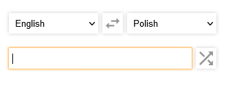

# Translator
This simple Firefox plugin was developed to meet my personal requirements. It's small and easy to use, lets you translate words using google, look them up in google search and copy them to clipboard.



## how to build
Simply open terminal in project directory and run:
```
npm install     // install all dependencies
npm build       // builds the project into dist folder
```

Now you can load this plugin using firefox's about:debugging page.

## requirements
To build this project you need Node.js with NPM installed on your system: https://nodejs.org/

## how to use
There are two dropdown menus, left is the source language, right is destination language. As destination language by default System language is used.
Between them there is a button, that toggles languages.
Below you can find text filed, which is a source of text to translate. To translate click Enter or button to the right with corrse arrows icon.
After translation command, below new text appears. It's text from text field translated to destination language.
On the right side of this translation there are 'Copy to Clipboard' and 'Search in Google' buttons respectively.

## icons
Icons made by <a href="https://www.flaticon.com/authors/google" title="Google">Google</a> from <a href="https://www.flaticon.com/" title="Flaticon">www.flaticon.com</a>

## author
**Marcin Rogalski** - [ mail me ]( mailto:marcinrogalski@interia.eu )
